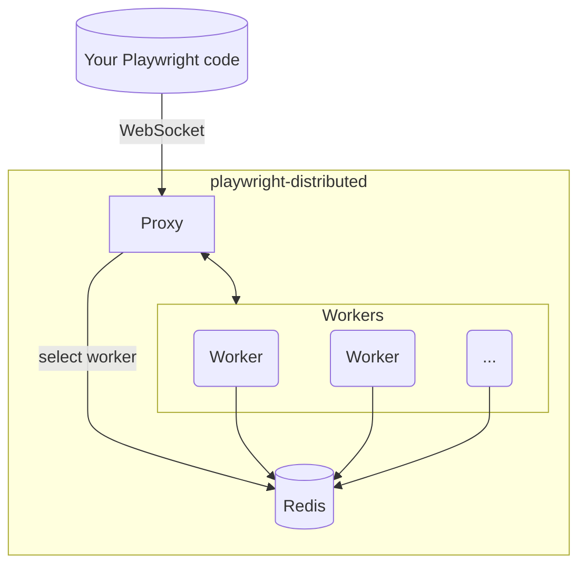

<p align="center">
  
</p>

<h1 align="center">playwright-distributed</h1>

<p align="center">
  <strong>Self-hosted, horizontally-scalable <a href="https://playwright.dev/">Playwright</a> grid.</strong><br/>
  Spin up as many browser workers as you need on your own infrastructure and access them through a single WebSocket endpoint.
</p>

<p align="center">
  <a href="LICENSE"></a>
</p>

---

## Why use playwright-distributed?
- Single WebSocket endpoint routes each session through a smart selector that balances load *and* staggers worker restarts.
- Warm browser instances (Chrome, Firefox, WebKit) - no waiting for browser startup.
- Each client connection gets isolated browser state while keeping normal Playwright APIs like `browser.newContext()` and `browser.newPage()`.
- Stateless design: add or remove workers at any time; Redis is the only shared component.
- Works with any Playwright client.

### Motivation

Modern teams often need **many concurrent browsers**: scraping pipelines, AI agents, CI test suites, synthetic monitors… Spawning a fresh headless browser for every task wastes tens of seconds and huge amounts of memory. Existing SaaS grids solve this but:

1. You may not want to ship data to a third-party cloud.
2. Vendor pricing scales linearly with sessions.
3. Latency to a remote grid quickly adds up.

`playwright-distributed` lets you run **your own grid** with Docker-simple deployment:

- Keep data on your infrastructure.
- Pay only for the compute you actually run (add/remove workers on demand).
- Share one endpoint across languages, teams and use-cases.


## 🚀 Quick Start (Local)

```bash
# 1. Grab the repo
git clone https://github.com/mbroton/playwright-distributed.git
cd playwright-distributed

# 2. Fire it up (proxy + 1 Chrome worker + Redis)
docker compose up -d
```

Connect from your code:

```js
import { chromium } from 'playwright';

const browser = await chromium.connect('ws://localhost:8080');
const context = await browser.newContext();
const page = await context.newPage();
await page.goto('https://example.com');
console.log(await page.title());
await browser.close();
```

> Want Firefox or WebKit? Append `?browser=firefox` or `?browser=webkit` to the WebSocket URL and use the matching Playwright client (`p.firefox.connect`, `p.webkit.connect`, etc.).
That's it! The same `ws://localhost:8080` endpoint works with any Playwright client (Node.js, Python, Java, .NET, etc.).

## 🔌 Connect Contract

- Connect to `GET /` over WebSocket.
- The only supported query parameter is `browser=chromium|firefox|webkit`.
- If `browser` is omitted, the proxy uses `DEFAULT_BROWSER_TYPE`, which defaults to `chromium`.
- Use the matching Playwright client for the browser you request.
- A successful `connect()` returns a normal Playwright `Browser`. Create contexts with `browser.newContext()` or use `browser.newPage()` as the single-page convenience path.
- Contexts created through one client connection are isolated from other client connections.
- `PROXY_READ_HEADER_TIMEOUT` limits how long the server waits for request headers.
- `PROXY_WORKER_SELECTION_TIMEOUT` is the main queue-wait timeout: if no matching worker is eligible, or a selected worker fails fast before handoff succeeds, the proxy keeps retrying until this timeout expires.
- `PROXY_CONNECT_TIMEOUT` gives the first selected-worker handoff its full budget. During reselection, later attempts can be shorter because the remaining `PROXY_WORKER_SELECTION_TIMEOUT` budget still wins.
- Breaking change: `PROXY_CONNECT_TIMEOUT` no longer means the whole pre-upgrade path.
- Proxy-owned failures are returned as JSON until the client WebSocket upgrade begins:

```json
{"error":{"code":503,"message":"worker selection timed out"}}
```

- Stable JSON error messages are:
  - `unsupported browser; allowed values: chromium, firefox, webkit`
  - `unsupported query parameters; only browser is allowed`
  - `websocket upgrade required`
  - `worker selection timed out`
  - `connect timed out after selecting worker`
  - `selected worker unavailable`
- `selected worker unavailable` means the proxy saw a fast selected-worker failure and could not complete the handoff with another worker before the selection budget was exhausted.
- Fast retry-path rollback happens in the background so slow Redis bookkeeping does not delay reselection. The tradeoff is that `allocated_sessions` can stay temporarily inflated while rollback catches up, but worker drain timing still follows committed successful sessions.
- If Gorilla has already started the client upgrade handshake, the proxy still logs the exact failure and rolls back worker bookkeeping, but it may close the connection instead of returning a fresh JSON error body.
- Malformed WebSocket handshakes after upgrade headers are present use standards-aligned HTTP responses instead of JSON:
  - `405 Method Not Allowed` for non-`GET` requests
  - `400 Bad Request` for invalid `Sec-WebSocket-Version` or `Sec-WebSocket-Key`
  - version failures include `Sec-Websocket-Version: 13`


## 🛠 Use Cases

| Scenario | Benefit |
|----------|---------|
| **AI / LLM agents** | Give each agent an isolated browser with zero startup cost. |
| **Web scraping / data collection** | Crawl at scale; add workers to raise throughput, remove them to save money. |
| **CI end-to-end tests** | Parallelise test runs across many browsers and cut build times dramatically. |
| **Synthetic monitoring** | Continuously exercise critical user journeys from multiple regions. |
| **Shared “browser-as-a-service”** | One endpoint for your whole team – no more local browser zoo. |


## ⚙️ Production Deployment

Run each component (proxy, Redis, workers) as independent services (Docker/K8s). Checklist:

- **Worker runtime** – workers are intended to run in the official Playwright Docker image. If you run `worker/` directly on a host instead, install matching Playwright browser binaries separately.
- **Networking**
  - Workers ➜ Redis (register, heartbeats)
  - Proxy ➜ Redis (worker discovery)
  - Proxy ➜ Workers (WebSocket forward)
- **Exposure** – expose **only the proxy**.
- **Scaling** – add or remove workers freely; the proxy always chooses the next worker according to the staggered-restart algorithm.


## 📚 Usage Examples

### Node.js

```js
import { chromium, firefox, webkit } from 'playwright';

// connect() returns a Browser; create a context explicitly.
const browser = await chromium.connect('ws://localhost:8080');
const context = await browser.newContext();
const page = await context.newPage();
await page.goto('https://example.com');
console.log(await page.title());
await browser.close();

// Target Firefox workers explicitly.
const firefoxBrowser = await firefox.connect('ws://localhost:8080?browser=firefox');
await firefoxBrowser.close();

// Or WebKit workers.
const webkitBrowser = await webkit.connect('ws://localhost:8080?browser=webkit');
await webkitBrowser.close();
```

### Python

```python
from playwright.async_api import async_playwright
import asyncio

async def main():
    async with async_playwright() as p:
        # Chromium (default)
        browser = await p.chromium.connect('ws://localhost:8080')
        context = await browser.new_context()
        page = await context.new_page()
        await page.goto('https://example.com')
        print(await page.title())
        await browser.close()

        # Firefox
        firefox = await p.firefox.connect('ws://localhost:8080?browser=firefox')
        await firefox.close()

        # WebKit
        webkit = await p.webkit.connect('ws://localhost:8080?browser=webkit')
        await webkit.close()

asyncio.run(main())
```

> Any Playwright-compatible client can connect to the same `ws://localhost:8080` endpoint.


## 🏗 Architecture



### Session Handling

1. **One connection → One isolated Playwright session** – each websocket connection gets an isolated view of its own contexts.
2. **Contexts are created by the client** – use `browser.newContext()` or `browser.newPage()` after `connect()`.
3. **Concurrent sessions** – each worker serves several client connections and contexts in parallel.
4. **Recycling** – after serving a configurable number of sessions the worker shuts down; Docker/K8s restarts it to keep browser processes fresh.
5. **Smart worker selection** – the proxy's algorithm keeps workers from hitting their restart threshold at the same time and still favours the least-loaded eligible worker.


## 🗺️ Roadmap

Here's what's planned for the near future:

- **Documentation:** Create comprehensive guides for deployment (K8s, bare metal) and various use-cases.
- **Testing:** Implement a full test suite to ensure stability and reliability.


## 🤝 Contributing

Found a bug? Have an idea for improvement? PRs and issues are welcome!

## 📜 License

This project is licensed under the [Apache-2.0 License](LICENSE).
