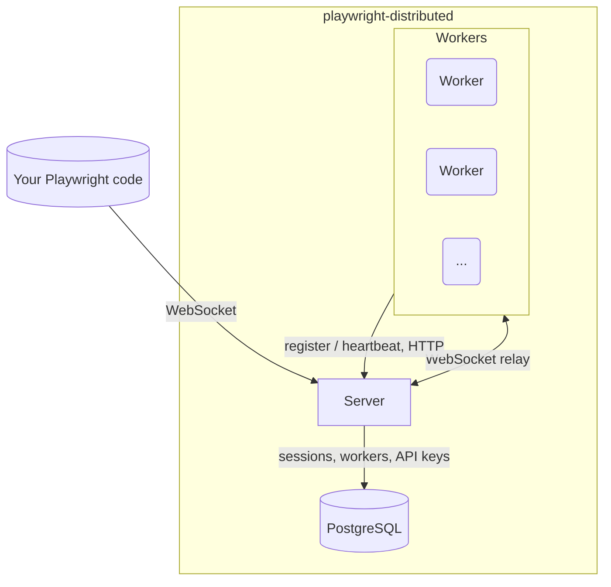

<p align="center">
  
</p>

<h1 align="center">playwright-distributed</h1>

<p align="center">
  <strong>A self-hosted fleet of browsers behind one endpoint.</strong><br/>
  Run warm <a href="https://playwright.dev/">Playwright</a> browsers on your own machines. Connect from anywhere with one line of code.
</p>

<p align="center">
  <a href="https://github.com/mbroton/playwright-distributed/actions/workflows/ci.yml"></a>
  <a href="LICENSE"></a>
</p>

---

```js
import { chromium } from 'playwright';

const browser = await chromium.connect('ws://your-grid:8080');
// A fresh, isolated browser session. No launch, no install, no cleanup.
```

Every connection gets its own isolated session on a browser that is already
running. Close the connection and the session is gone. The fleet handles the
rest: which worker serves you, what happens when one crashes, and when a
browser gets recycled for a fresh one.

## What you get

- **One endpoint, every Playwright client.** The same `ws://` URL works from
  Node.js, Python, Java, and .NET. Chromium, Firefox, and WebKit workers can
  serve the same grid (`?browser=firefox`).
- **No browser launch on the request path.** Workers keep browsers running;
  connecting is a WebSocket dial, not a cold start.
- **Isolated sessions.** Each connection is a fresh session with its own
  contexts, cookies, and storage. Sessions never see each other.
- **Self-healing capacity.** Sessions and workers are rows in PostgreSQL. If
  a worker dies mid-session, the grid closes out its sessions and reclaims
  the capacity, and workers register themselves on start — no operator in
  the loop.
- **Your infrastructure.** Data stays on your network. Scaling is adding
  worker containers. There is no per-session bill.

## Quick start

```bash
curl -LO https://raw.githubusercontent.com/mbroton/playwright-distributed/main/docker-compose.yaml
docker compose up -d
```

That starts the server, PostgreSQL, and one Chromium worker. Connect:

```js
import { chromium } from 'playwright';

const browser = await chromium.connect('ws://localhost:8080');
const page = await (await browser.newContext()).newPage();
await page.goto('https://example.com');
console.log(await page.title());
await browser.close();
```

> Your client's Playwright `major.minor` version must match a registered
> worker's version — the server routes each client to a version-matched
> worker.

Grow the grid by adding workers — each serves up to `MAX_SLOTS` (default 5)
concurrent sessions:

```bash
docker compose up -d --scale worker=5    # 25 session slots
```

For Firefox or WebKit, add a worker service with `BROWSER_TYPE=firefox` or
`BROWSER_TYPE=webkit` (copy the `worker` service in the compose file; see
`docker-compose.local.yaml` in the repository for a three-browser stack) and
connect with `firefox.connect('ws://host:8080/?browser=firefox')`.

## Who it's for

| You run | The grid gives you |
|---------|--------------------|
| AI agents | An isolated browser per agent, available the moment the agent asks. |
| Scraping pipelines | Throughput that scales by adding workers, and shrinks to save money. |
| CI end-to-end tests | Parallel browsers without installing them on every runner. |
| Synthetic monitoring | Long-running checks on browsers that recycle themselves. |
| A platform team | One internal browser endpoint instead of a browser install per team. |

## How it compares

Self-hosted, Playwright-native options:

| | playwright-distributed | Browserless | Aerokube Moon |
|---|---|---|---|
| License | Apache-2.0 | source-available, paid tiers | commercial, free up to 4 parallel browsers |
| Runs on | any Docker host | any Docker host | Kubernetes / OpenShift only |
| Multi-node fleet built in | ✅ | ❌ one instance per node, bring your own load balancer | ✅ |
| Browsers stay warm between sessions | ✅ | ❌ launched per session | ❌ pod launched per session |
| Native Playwright protocol | ✅ | ✅ | ✅ |
| Chromium + Firefox + WebKit | ✅ | ✅ | ✅ |
| Session records and control (REST) | ✅ with history | live only | live UI |

Warm sharing is a trade, not a free win: sessions are isolated as browser
contexts rather than processes (see [Security boundary](#security-boundary)),
and launch flags cannot vary per session; worker recycling caps how long any
browser lives.

Related tools outside the table:

- **Hosted browser platforms** (Browserbase, Steel, Cloudflare Browser Run,
  Browserless cloud, …): no infrastructure to run; the browsers live outside
  your network, pricing is per session or usage, and Playwright mostly
  connects to them over CDP (`connectOverCDP`) rather than its native
  protocol.
- **Selenium Grid**: multi-node and mature, but WebDriver-based; Playwright
  connects to it only through an experimental Chrome/Edge bridge.
- **AI agent frameworks** (Stagehand, browser-use, …): clients, not grids —
  they drive a browser endpoint rather than provide one.

## Architecture


```mermaid
flowchart TD
    Client[(Your Playwright code)] -->|WebSocket| Server

    subgraph playwright-distributed
        direction LR

        Server -->|sessions, workers, API keys| PostgreSQL[(PostgreSQL)]
        Server <-->|WebSocket relay| workerGroup
        workerGroup -->|register / heartbeat, HTTP| Server

        subgraph workerGroup [Workers]
            direction LR
            Worker1(Worker)
            Worker2(Worker)
            WorkerN(...)
        end
    end
```

- **The server** is a single Go binary: it authenticates clients, picks a
  worker, relays the WebSocket bytes, and exposes a REST API for sessions,
  workers, and capacity.
- **Workers** are containers built on the official Playwright image. Each
  keeps one browser running and serves up to `MAX_SLOTS` concurrent
  sessions; every session creates its own isolated contexts on that browser.
- **PostgreSQL** holds all durable state: sessions, workers, and API keys
  are rows. Sessions of dead workers are closed out automatically, so
  capacity recovers without intervention.
- **Recycling**: after a configurable number of sessions, a worker drains
  and restarts with a fresh browser. Selection concentrates load on the
  longest-serving worker, so recycles tend to happen one worker at a time.

The repository also ships a reproducible benchmark suite
([`bench/`](bench/README.md)) measuring time-to-first-page and session
throughput, with the full methodology documented.

<!-- TODO(cloud-bench): add the two-machine cloud numbers here before release. -->

## Production deployment

Run the server, PostgreSQL, and workers as independent services (Docker or
Kubernetes):

- **Networking**: workers → server (HTTP: register, heartbeat), server →
  workers (WebSocket dial), server → PostgreSQL.
- **Exposure**: keep PostgreSQL and workers private; expose only the server.
- **Authentication**: a server with zero API keys runs in open bootstrap
  mode. Create the first key
  (`docker compose exec server server apikey create --name <name>`) and from
  then on every request except health checks needs a key; hand it to every
  worker (`WORKER_API_KEY`) and client
  (`chromium.connect('ws://host:8080/?token=pwd_...')`) in the same step.
- **Scaling**: add or remove worker containers freely; each registers itself
  and starts serving.

See [`server/README.md`](server/README.md) for the full configuration and
API reference.

### Security boundary

The grid trusts every authenticated client (in bootstrap mode: every client
that can reach the server) while letting browsers visit untrusted pages. The
compose files bind the server to `127.0.0.1`, keep PostgreSQL and workers on
an internal network, and run workers as a non-root user with Playwright's
Chromium sandbox profile.

An API key grants full browser and control-plane access, and authentication
does not encrypt plain `http://`/`ws://` traffic — put the server behind a
TLS reverse proxy, VPN, or private network. Containers are hardening, not a
strong isolation boundary against hostile tenants or browser exploits; use
dedicated VMs where that boundary is required. See
[Playwright's Docker security guidance](https://playwright.dev/docs/docker).

## Usage examples

### Python

```python
from playwright.async_api import async_playwright
import asyncio

async def main():
    async with async_playwright() as p:
        browser = await p.chromium.connect('ws://localhost:8080')
        context = await browser.new_context()
        page = await context.new_page()
        await page.goto('https://example.com')
        print(await page.title())
        await browser.close()

asyncio.run(main())
```

### Sessions over REST

Create a session through the API to get an ID you can inspect, connect to,
and terminate:

```bash
curl -s localhost:8080/v1/capacity               # slots and queue depth
curl -s localhost:8080/v1/workers                # the fleet

# Create a session, then connect to it by ID:
curl -s -X POST localhost:8080/v1/sessions \
  -H 'Content-Type: application/json' \
  -d '{"browser": "chromium", "playwright_version": "1.62.1"}'
# -> { "id": "..." }  connect: chromium.connect('ws://localhost:8080/sessions/<id>')

curl -s localhost:8080/v1/sessions/<id>          # inspect it
curl -X DELETE localhost:8080/v1/sessions/<id>   # terminate it, even mid-use
```

## Roadmap

- Persistent sessions: keep a browser session alive between connections and
  reattach to it by ID.
- Kubernetes deployment guide.
- Prometheus metrics and a dashboard over the existing REST API.

## Contributing

Bugs, ideas, and pull requests are welcome — open an issue.

## License

[Apache-2.0](LICENSE).
