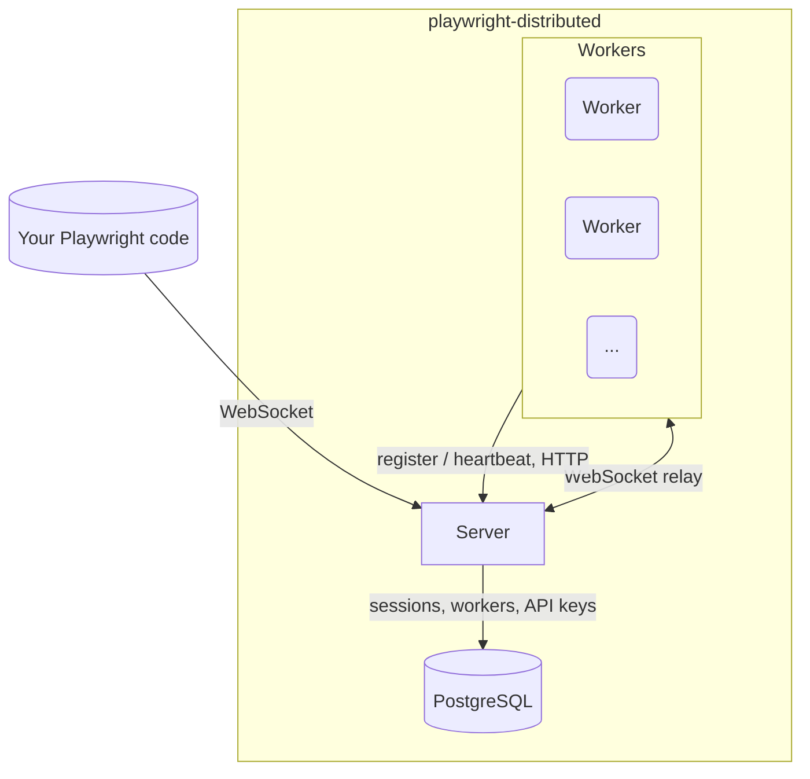

<p align="center">
  
</p>

<h1 align="center">playwright-distributed</h1>

<p align="center">
  <strong>Turn any Docker host into a browser grid.</strong><br/>
  Warm <a href="https://playwright.dev/">Playwright</a> browsers behind one endpoint — connect from any language with one line.
</p>

<p align="center">
  <a href="https://github.com/mbroton/playwright-distributed/actions/workflows/ci.yml"></a>
  <a href="LICENSE"></a>
</p>

---

Start workers anywhere — they register themselves. Every connection gets its
own isolated session on a browser that is already running. Which worker
serves you, what happens when one dies, when a browser gets recycled — the
grid's problem, not your code's.

## Quick start

**1. Start the grid** — the server, PostgreSQL, and one Chromium worker:

```bash
curl -LO https://raw.githubusercontent.com/mbroton/playwright-distributed/main/docker-compose.yaml
curl --create-dirs -o worker/seccomp_profile.json https://raw.githubusercontent.com/mbroton/playwright-distributed/main/worker/seccomp_profile.json
docker compose up -d
```

**2. Connect** — you get a fresh session (in milliseconds — see
[the comparison](#warm-browsers-vs-a-browser-per-session)); do your work
and close, everything is cleaned up for the next client:

```js
import { chromium } from 'playwright';

const browser = await chromium.connect('ws://localhost:8080');
const page = await (await browser.newContext()).newPage();
await page.goto('https://example.com');
console.log(await page.title());
await browser.close();
```

> Your client's Playwright `major.minor` version must match a registered
> worker's version — the server routes each client to a version-matched
> worker.

That's the whole setup. When you need more browsers, add workers — each
serves up to `MAX_SLOTS` (default 5,
[how to tune it](worker/README.md)) concurrent sessions:

```bash
docker compose up -d --scale worker=5    # 25 session slots
```

For Firefox or WebKit, add a worker service with `BROWSER_TYPE=firefox` or
`BROWSER_TYPE=webkit` (copy the `worker` service in the compose file; see
`docker-compose.local.yaml` in the repository for a three-browser stack) and
connect with `firefox.connect('ws://host:8080/?browser=firefox')`.

## What you get

- **One endpoint, every Playwright client.** The same `ws://` URL works from
  Node.js, Python, Java, and .NET — Chromium, Firefox, and WebKit alike.
- **No browser launch on the request path.** Connecting is a WebSocket dial,
  not a cold start.
- **Parallel, isolated sessions.** Each worker serves several sessions at
  once; sessions never see each other.
- **Self-healing capacity.** Workers register themselves and dead workers'
  sessions are closed out automatically — no operator in the loop.
- **Your infrastructure.** Data stays on your network. There is no
  per-session bill.

## Who it's for

| You run | The grid gives you |
|---------|--------------------|
| AI agents | An isolated browser per agent, available the moment the agent asks. |
| Scraping pipelines | Throughput that scales by adding workers, and shrinks to save money. |
| CI end-to-end tests | Parallel browsers without installing them on every runner. |
| Synthetic monitoring | Long-running checks on browsers that recycle themselves. |
| A platform team | One internal browser endpoint instead of a browser install per team. |

## How it compares

Self-hosted, Playwright-native options:

| | playwright-distributed | Browserless | Aerokube Moon |
|---|---|---|---|
| License | Apache-2.0 | SSPL-1.0 or commercial | commercial, free up to 4 parallel browsers |
| Runs on | any Docker host | any Docker host | Kubernetes / OpenShift only |
| Parallel sessions | ✅ workers × `MAX_SLOTS` | ✅ per-instance cap | ✅ capped by license |
| Scales beyond one machine | ✅ built in — start more workers on any host | ✅ more containers behind your own load balancer | ✅ |
| Browsers stay warm between sessions | ✅ | ❌ launched per session | ❌ pod launched per session |
| Session records and control (REST) | ✅ with history | live only | live UI |

### Warm browsers vs a browser per session

The biggest practical difference in the table is how a session gets its
browser. Browserless starts a fresh browser for every connection; here,
sessions run on browsers that are already warm. Side by side on an AWS
`m8i.xlarge` (4 vCPUs, 16 GB), same Playwright version, one worker vs one
node:

| | playwright-distributed | Browserless |
|---|---|---|
| Get a browser, open a page, read it | **51 ms** | 217 ms |
| CPU used per task | **0.09 s** | 0.70 s |
| 1,000 such tasks, 5 at a time | **26 s** | 154 s |

The saving repeats on every session, so it adds up fastest for services that
open and close browsers all day.

Sharing a warm browser is a trade. Each session is an isolated browser
context — own cookies, storage, and cache — but it shares the browser
process with the other sessions on its worker:

- A separate process is a harder wall around a hostile page (see
  [Security boundary](#security-boundary)).
- Browser command-line flags are set when the worker starts, so one session
  cannot bring its own — say, a browser extension — the way a
  freshly-launched browser can. Per-session proxy, locale, viewport, and
  cookies work as usual via contexts.
- If the shared browser crashes, all sessions on that worker end with it;
  the grid closes them out and the container restarts with a fresh browser.

Many workloads never feel these limits: taking screenshots, scraping sites
you chose, or running your own test suite needs neither a process wall
around each page nor per-session browser flags.

## Architecture


```mermaid
flowchart TD
    Client[(Your Playwright code)] -->|WebSocket| Server

    subgraph playwright-distributed
        direction LR

        Server -->|sessions, workers, API keys| PostgreSQL[(PostgreSQL)]
        Server <-->|WebSocket relay| workerGroup
        workerGroup -->|register / heartbeat, HTTP| Server

        subgraph workerGroup [Workers]
            direction LR
            Worker1(Worker)
            Worker2(Worker)
            WorkerN(...)
        end
    end
```

- **The server** is a single Go binary: it authenticates clients, picks a
  worker, relays the WebSocket bytes, and exposes a REST API for sessions,
  workers, and capacity.
- **Workers** are containers built on the official Playwright image. Each
  keeps one browser running and serves up to `MAX_SLOTS` concurrent
  sessions; every session creates its own isolated contexts on that browser.
- **PostgreSQL** holds all durable state: sessions, workers, and API keys
  are rows. Sessions of dead workers are closed out automatically, so
  capacity recovers without intervention.
- **Recycling**: after a configurable number of sessions, a worker drains
  and restarts with a fresh browser. Selection concentrates load on the
  longest-serving worker, so recycles tend to happen one worker at a time.

## Production deployment

Run the server, PostgreSQL, and workers as independent services (Docker or
Kubernetes):

- **Networking**: workers → server (HTTP: register, heartbeat), server →
  workers (WebSocket dial), server → PostgreSQL.
- **Exposure**: keep PostgreSQL and workers private; expose only the server.
- **Authentication**: a server with zero API keys runs in open bootstrap
  mode. Create the first key
  (`docker compose exec server server apikey create --name <name>`) and from
  then on every request except health checks needs a key; hand it to every
  worker (`WORKER_API_KEY`) and client
  (`chromium.connect('ws://host:8080/?token=pwd_...')`) in the same step.
- **Scaling**: add or remove worker containers freely; each registers itself
  and starts serving.

See [`server/README.md`](server/README.md) for the full configuration and
API reference.

### Security boundary

The grid trusts every authenticated client (in bootstrap mode: every client
that can reach the server) while letting browsers visit untrusted pages. The
compose files bind the server to `127.0.0.1`, keep PostgreSQL and workers on
an internal network, and run workers as a non-root user with Playwright's
Chromium sandbox profile.

An API key grants full browser and control-plane access, and authentication
does not encrypt plain `http://`/`ws://` traffic — put the server behind a
TLS reverse proxy, VPN, or private network. Containers are hardening, not a
strong isolation boundary against hostile tenants or browser exploits; use
dedicated VMs where that boundary is required. See
[Playwright's Docker security guidance](https://playwright.dev/docs/docker).

## Usage examples

### Python

```python
from playwright.async_api import async_playwright
import asyncio

async def main():
    async with async_playwright() as p:
        browser = await p.chromium.connect('ws://localhost:8080')
        context = await browser.new_context()
        page = await context.new_page()
        await page.goto('https://example.com')
        print(await page.title())
        await browser.close()

asyncio.run(main())
```

### Sessions over REST

Create a session through the API to get an ID you can inspect, connect to,
and terminate:

```bash
curl -s localhost:8080/v1/capacity               # slots and queue depth
curl -s localhost:8080/v1/workers                # the whole grid

# Create a session, then connect to it by ID:
curl -s -X POST localhost:8080/v1/sessions \
  -H 'Content-Type: application/json' \
  -d '{"browser": "chromium", "playwright_version": "1.62.1"}'
# -> { "id": "..." }  connect: chromium.connect('ws://localhost:8080/sessions/<id>')

curl -s localhost:8080/v1/sessions/<id>          # inspect it
curl -X DELETE localhost:8080/v1/sessions/<id>   # terminate it, even mid-use
```

## Roadmap

- Persistent sessions: keep a browser session alive between connections and
  reattach to it by ID.
- Kubernetes deployment guide.
- Prometheus metrics and a dashboard over the existing REST API.

## Contributing

Bugs and ideas are welcome — open an issue. Code changes should start as an
issue too, so the approach is agreed on before anyone writes it.

## License

[Apache-2.0](LICENSE).
