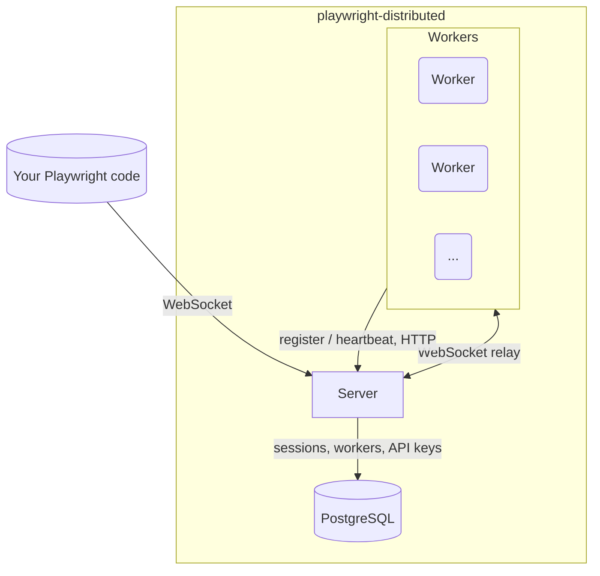

<p align="center">
  
</p>

<h1 align="center">playwright-distributed</h1>

<p align="center">
  <strong>Self-hosted, horizontally-scalable <a href="https://playwright.dev/">Playwright</a> grid.</strong><br/>
  Spin up as many browser workers as you need on your own infrastructure and access them through a single WebSocket endpoint.
</p>

<p align="center">
  <a href="LICENSE"></a>
</p>

---

## Why use playwright-distributed?
- Single WebSocket endpoint routes each session through a smart selector that balances load *and* staggers worker restarts.
- Warm browser instances (Chrome, Firefox, WebKit) - no waiting for browser startup.
- Each connection gets a fresh, isolated browser session.
- PostgreSQL stores sessions and workers as rows; a rescuer reclaims capacity after crashes.
- Optional API-key authentication and a small REST API expose sessions and capacity at `/v1/sessions` and `/v1/capacity`.
- Works with any Playwright client.

### Motivation

Modern teams often need **many concurrent browsers**: scraping pipelines, AI agents, CI test suites, synthetic monitors… Spawning a fresh headless browser for every task wastes tens of seconds and huge amounts of memory. Existing SaaS grids solve this but:

1. You may not want to ship data to a third-party cloud.
2. Vendor pricing scales linearly with sessions.
3. Latency to a remote grid quickly adds up.

`playwright-distributed` lets you run **your own grid** with Docker-simple deployment:

- Keep data on your infrastructure.
- Pay only for the compute you actually run (add/remove workers on demand).
- Share one endpoint across languages, teams and use-cases.


## 🚀 Quick Start (Local)

```bash
# 1. Grab the repo
git clone https://github.com/mbroton/playwright-distributed.git
cd playwright-distributed

# 2. Fire it up (server + 1 Chrome worker + Postgres)
docker compose up -d
```

Connect from your code:

```js
import { chromium } from 'playwright';

const browser = await chromium.connect('ws://localhost:8080');
const context = await browser.newContext();
const page = await context.newPage();
await page.goto('https://example.com');
console.log(await page.title());
await browser.close();
```

> Want Firefox or WebKit? The quick-start stack runs one Chromium worker. Add a worker service with `BROWSER_TYPE=firefox` or `BROWSER_TYPE=webkit` (see `docker-compose.local.yaml` for a three-browser example), then append `/?browser=firefox` or `/?browser=webkit` to the WebSocket URL and use the matching Playwright client (`p.firefox.connect`, `p.webkit.connect`, etc.). Your client's Playwright major.minor version must match a registered worker's version.

That's it! The same `ws://localhost:8080` endpoint works with any Playwright client (Node.js, Python, Java, .NET, etc.).


## 🛠 Use Cases

| Scenario | Benefit |
|----------|---------|
| **AI / LLM agents** | Give each agent an isolated browser with zero startup cost. |
| **Web scraping / data collection** | Crawl at scale; add workers to raise throughput, remove them to save money. |
| **CI end-to-end tests** | Parallelise test runs across many browsers and cut build times dramatically. |
| **Synthetic monitoring** | Continuously exercise critical user journeys from multiple regions. |
| **Shared “browser-as-a-service”** | One endpoint for your whole team – no more local browser zoo. |


## ⚙️ Production Deployment

Run the server, PostgreSQL, and workers as independent services (Docker/K8s). Checklist:

- **Worker runtime** – workers are intended to run in the official Playwright Docker image. If you run `worker/` directly on a host instead, install matching Playwright browser binaries separately.
- **Networking**
  - Workers ➜ Server (register and heartbeat over HTTP)
  - Server ➜ Workers (WebSocket dial)
  - Server ➜ PostgreSQL (session, worker, and API-key records)
- **Exposure** – keep PostgreSQL and workers private. The server supports bearer-token authentication with API keys. Zero keys means unauthenticated bootstrap mode; create the first key to lock it, and give that key to every worker (`WORKER_API_KEY`) and client in the same step. A locked server accepts clients with a query token: `chromium.connect('ws://host:8080/?token=pwd_...')`.
- **Scaling** – add or remove workers freely; the server chooses the next worker according to the staggered-restart algorithm.

See [`server/README.md`](server/README.md) for the full server environment, configuration, and authentication reference.

### Security boundary

The supported deployment model trusts every authenticated client that can reach the server, while allowing browsers to visit untrusted pages. In bootstrap mode, it trusts every client. The Compose files bind the server to `127.0.0.1`, keep PostgreSQL and workers on the internal network, and run workers as a non-root user with Playwright's Chromium sandbox profile.

An API key grants full browser and control-plane access. Authentication does not encrypt plain `http://` or `ws://` traffic. Never publish the server directly to an untrusted network; use a TLS reverse proxy, VPN, or private service network. Container hardening reduces risk but is not a strong isolation boundary for hostile tenants or browser exploits. Use dedicated VMs or another stronger sandbox when that boundary is required. See [Playwright's Docker security guidance](https://playwright.dev/docs/docker).


## 📚 Usage Examples

### Node.js

```js
import { chromium, firefox, webkit } from 'playwright';

// Chromium workers connect without any query parameters.
const browser = await chromium.connect('ws://localhost:8080');
const context = await browser.newContext();
const page = await context.newPage();
await page.goto('https://example.com');
console.log(await page.title());
await browser.close();

// Target Firefox workers explicitly.
const firefoxBrowser = await firefox.connect('ws://localhost:8080/?browser=firefox');
await firefoxBrowser.close();

// Or WebKit workers.
const webkitBrowser = await webkit.connect('ws://localhost:8080/?browser=webkit');
await webkitBrowser.close();
```

### Python

```python
from playwright.async_api import async_playwright
import asyncio

async def main():
    async with async_playwright() as p:
        # Chromium (default)
        browser = await p.chromium.connect('ws://localhost:8080')
        context = await browser.new_context()
        page = await context.new_page()
        await page.goto('https://example.com')
        print(await page.title())
        await browser.close()

        # Firefox
        firefox = await p.firefox.connect('ws://localhost:8080/?browser=firefox')
        await firefox.close()

        # WebKit
        webkit = await p.webkit.connect('ws://localhost:8080/?browser=webkit')
        await webkit.close()

asyncio.run(main())
```

> Any Playwright-compatible client can connect to the same `ws://localhost:8080` endpoint.


## 🏗 Architecture


```mermaid
flowchart TD
    Client[(Your Playwright code)] -->|WebSocket| Server

    subgraph playwright-distributed
        direction LR

        Server -->|sessions, workers, API keys| PostgreSQL[(PostgreSQL)]
        Server <-->|WebSocket relay| workerGroup
        workerGroup -->|register / heartbeat, HTTP| Server

        subgraph workerGroup [Workers]
            direction LR
            Worker1(Worker)
            Worker2(Worker)
            WorkerN(...)
        end
    end
```

### Session Handling

1. **One connection → One session** – every websocket is an isolated Playwright session; your client creates as many browser contexts inside it as it needs.
2. **Session records** – every connection is a session record with an ID that you can inspect or delete through the REST API.
3. **Concurrent sessions** – each worker serves several sessions in parallel.
4. **Recycling** – the server counts lifetime sessions and returns a drain command in the worker's heartbeat response; the worker then restarts with a fresh browser.
5. **Smart worker selection** – selection is staggered by lifetime-session count, then balanced toward the least loaded eligible worker.


## 🗺️ Roadmap

Here's what's planned for the near future:

- **Documentation:** Create comprehensive guides for deployment (K8s, bare metal) and various use-cases.
- **Testing:** Implement a full test suite to ensure stability and reliability.


## 🤝 Contributing

Found a bug? Have an idea for improvement? PRs and issues are welcome!

## 📜 License

This project is licensed under the [Apache-2.0 License](LICENSE).
